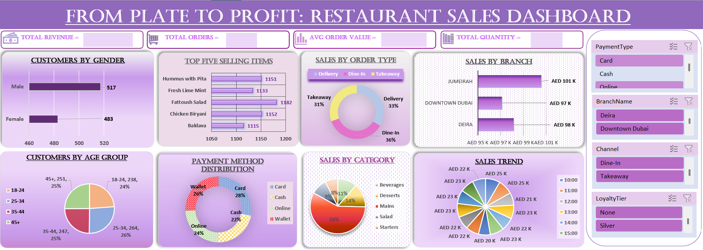

# 🍽️ Restaurant Business Performance Dashboard | Excel

## 📌 Project Overview

The Restaurant Business Performance Dashboard is an interactive Excel-based business intelligence solution designed to analyze restaurant sales performance, customer trends, menu performance, and operational metrics.

The dashboard provides a centralized view of key business indicators, helping stakeholders monitor performance, identify trends, and make data-driven decisions.

---

## 🎯 Objectives

- Monitor restaurant sales performance
- Analyze customer purchasing patterns
- Identify top-performing menu categories
- Track revenue and order trends
- Improve operational decision-making
- Support business growth through data insights

---

## 🛠️ Tools & Techniques Used

- Microsoft Excel
- Pivot Tables
- Pivot Charts
- Slicers
- Conditional Formatting
- Data Cleaning
- Data Analysis
- Dashboard Design

---

## 📊 Dashboard Features

### Sales Performance Analysis

- Total Revenue Tracking
- Monthly Sales Trends
- Revenue by Category
- Revenue by Product

### Customer Analysis

- Customer Purchase Behavior
- Order Frequency Analysis
- Customer Contribution Analysis

### Menu Performance

- Best-Selling Items
- Category Performance
- Revenue Contribution by Product

### Operational Insights

- Order Trends
- Peak Sales Periods
- Business Performance Monitoring

---

## 📈 Key Business Metrics

- Total Revenue
- Total Orders
- Average Order Value
- Top-Selling Menu Items
- Category Contribution
- Monthly Performance Trends

---

## 📷 Dashboard Preview

### Restaurant Dashboard



---

## 💡 Key Insights

- Identified top-performing menu categories.
- Analyzed monthly revenue trends.
- Evaluated customer ordering behavior.
- Highlighted high-revenue products.
- Supported strategic business decisions through visual analytics.

---

## 📂 Repository Contents

```text
Restaurant-Business-Performance-Dashboard/
│
├── Restaurant_dashboard_new.xlsx
├── Restaurant_Dashboard.png
└── README.md
```

---

## 🚀 Skills Demonstrated

- Data Cleaning
- Data Analysis
- Pivot Tables
- Pivot Charts
- Dashboard Development
- Excel Reporting
- Data Visualization
- Business Analysis

---

## 📌 Conclusion

This Excel dashboard demonstrates how spreadsheet-based analytics can transform restaurant sales data into actionable business insights. Through interactive visualizations and KPI monitoring, stakeholders can efficiently track performance and identify opportunities for growth.
